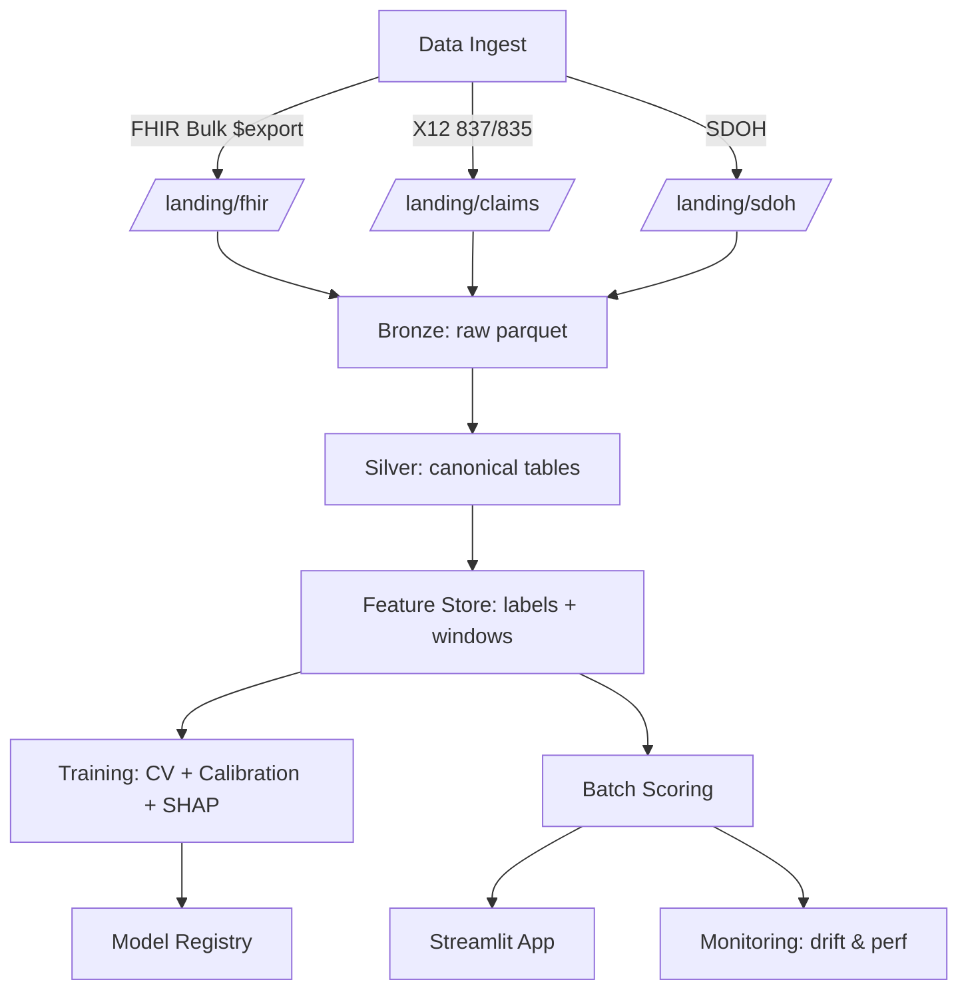

# QMTRY-Pophealth-Readmissions 🚀🏥

> 🧠 **Predict high-risk members. Slash avoidable admissions. Show your work like a boss.**

Hey, population health heroes! 👋 Tired of readmissions sneaking up like uninvited guests at a party? This repo is your **reproducible, audit-ready demo** for predicting 30-day readmissions and potentially avoidable admissions (ACSC) using ML magic, LACE baselines, SHAP explainability, and a slick Streamlit dashboard. Built on **synthetic data (no PHI drama)**, it's plug-and-play for client pilots to cut costs, boost Stars ratings, and make care managers' lives easier. Let's turn data into dollars! 💰

<p align="center">

</p>

## 🧭 Table of Contents
- [🎯 Why This Exists](#-why-this-exists)
- [📦 What You Get](#-what-you-get)
- [🚀 Quickstart (5-Minute Demo)](#-quickstart-5-minute-demo)
- [🗂️ Data & Schemas](#-data--schemas)
- [🧪 Feature Engineering](#-feature-engineering)
- [🤖 Models, Baselines & Explainability](#-models-baselines--explainability)
- [📈 Evaluation & Calibration](#-evaluation--calibration)
- [🧑‍⚕️ Care-Manager Workflow](#-care-manager-workflow)
- [🖥️ Dashboard (Streamlit)](#-dashboard-streamlit)
- [💸 ROI Calculator](#-roi-calculator)
- [🏗️ Architecture](#-architecture)
- [🗺️ Repo Layout](#-repo-layout)
- [🛡️ Governance & Compliance](#-governance--compliance)
- [🤝 Pilot with QMTRY](#-pilot-with-qmtry)
- [❓ FAQ](#-faq)
- [🗺️ Roadmap](#-roadmap)
- [📜 License](#-license)
- [📫 Contact](#-contact)

## 🎯 Why This Exists
Healthcare teams are battling readmissions and preventable admits that **could be dodged** with smart, timely interventions. But most models are black boxes or siloed from real workflows. This repo delivers **the full monty**:
- **Transparent predictions** (calibrated + SHAP'd) that outperform clinical baselines like LACE.
- **Operational worklists** tailored to your team's capacity, with actionable next steps.
- **Executive ROI insights** to prove the value in cold, hard cash.
- **Privacy-safe vibes** using Synthea-generated data + synthetic SDOH/Rx signals. No real PHI here – just demo awesomeness!

Why it matters? Lower avoidable utilization and total cost of care, focus care-manager time on game-changing interventions, and deliver audited, fair predictions with clear paths forward. Stars ratings? They'll thank you. ⭐

## 📦 What You Get
- **Streamlit App (Dark Theme)** 📊: Population overviews, outreach queues, and an ROI calculator that'll make execs swoon.
- **Reproducible Pipeline** 🏗️: Feature store (Parquet), training, calibration, SHAP, and eval – all scripted and ready.
- **Baselines** 📏: LACE/LACE+ for easy benchmarking.
- **Batch Scoring** ⚡: Plus optional FastAPI endpoint for real-time flair.
- **Monitoring** 🔍: Drift and performance checks with weekly reports.
- **Governance Goodies** 📝: Pre-filled Model Card and Data Protection Checklist templates.

Bonus: Hooks for CMS Stars – export queues, PDC distributions, SUPD/PDC signals, and provider attribution. Plug it in and watch the magic! ✨

## 🚀 Quickstart (5-Minute Demo)
Fire this up locally and see the sparks fly! No client data needed – we generate synthetic goodies.

```bash
python -m venv .venv && source .venv/bin/activate  # Windows: .venv\Scripts\activate
pip install -U pip wheel
pip install -r requirements.txt
# Build synthetic demo data (Synthea-derived + SDOH/Rx enrich)
python scripts/make_demo_data.py
# Train baseline + ML (XGBoost) and calibrate
python scripts/train.py --config configs/train_xgb.yaml
# Score a cohort as of a date
python scripts/score.py --as-of 2024-12-31
# Launch dashboard (dark mode)
streamlit run dashboard/App.py
```

Boom! You're predicting readmissions like a pro. 🦸‍♂️

## 🗂️ Data & Schemas
Demo data lives in `data_demo/` – all synthetic. For pilots, map your sources to our canonical schemas (detailed in `/schema/` with FHIR Bulk $export and 837/835 notes).

**Canonical Tables (Silver Layer):**
- `member`: ID, DOB, sex, payer, dual_status_proxy.
- `encounter`: ID, member_id, admit/discharge dates, LOS, MS-DRG, admit_type, disposition.
- `diagnosis`, `procedure`: ICD/PCS/SNOMED/CDM codes.
- `rx_fill`: NDC, fill_date, qty, days_supply.
- `lab`: LOINC, value, normal_flag, collected_at.
- `vital`: Type, value, collected_at.
- `sdoh_geo`: SVI themes 1-4, deprivation_proxy, rural_urban.

**Labels:**
- `readmit_30d`: Unplanned readmission within 30 days.
- `acsc_flag`: Potentially avoidable (ACSC/PQI lens).

Minimal client columns? We've got you covered – check the schema docs!

## 🧪 Feature Engineering
We turn raw data into predictive gold. Features are versioned in a Parquet store with as-of-date windows.

- **Utilization** 📅: Prior 12m/6m ED/IP counts, obs stays, time since last discharge.
- **Clinical Burden** 🩺: Charlson/Elixhauser flags; clusters for CHF/COPD/DM/CKD; recent abnormal labs.
- **Discharge Context** 🚪: LOS, weekend discharge, disposition, polypharmacy.
- **Adherence** 💊: PDC buckets (RASA, statins, diabetes), regimen complexity.
- **Access** 🗺️: Last PCP visit, open referrals, distance to care (proxy).
- **SDOH** 🌍: SVI themes, deprivation proxy, rural/urban.
- **Temporal** ⏰: Month/season, epidemic wave proxies.

Smart, right? No feature left behind! 🔍

## 🤖 Models, Baselines & Explainability
- **Baselines** 📏: LACE/LACE+ – simple, clinical risk scores for comparison.
- **ML Models** ⚙️: Gradient boosting (XGBoost/LightGBM) vs. logistic regression.
- **Calibration** 📐: Platt or isotonic methods; check Brier score, intercept, slope.
- **Explainability** 🔍: Global SHAP bars/summaries; local waterfalls for case reviews.
- **Thresholding** 🚧: Top-K for team capacity or cost-sensitive for max utility (savings minus outreach costs).

Dive into `docs/model_card.md` for intended uses, limitations, and subgroup breakdowns. Transparency is our jam! 🕵️‍♀️

## 📈 Evaluation & Calibration
Metrics land in `artifacts/metrics/` and shine in the dashboard.

- **Discrimination** 📊: AUROC, AUPRC.
- **Calibration** ⚖️: Reliability plots, Brier score, intercept/slope.
- **Ranking Utility** 🏆: Recall/Precision @ K (sized to your team).
- **Clinical Utility** 💡: Decision curves + ROI sensitivity.
- **Robustness** 🛡️: Temporal validation, ablation tests.

We don't just predict – we prove it works! 📉

## 🧑‍⚕️ Care-Manager Workflow
Daily batches score recent discharges (24-48h window).

**Outreach Queue Includes:**
- Risk score + reason codes (top SHAP features).
- Suggested actions: 7-day visits, meds recon, transport support.
- Export to CSV/XLSX for CRM/dialers.

Feedback loops refine the model. Tie in SUPD/PDC and attributions for Stars superpowers! ⭐

### Appendix B — Outreach Playbook (Demo)
- **Tier 1 (Very High Risk)** 🚨: RN call within 48h, meds reconciliation, schedule PCP 7-day visit, transport support.
- **Tier 2 (High)** ⚠️: Care navigator call within 72h, PCP visit within 14 days, pharmacy consult if PDC < 80%.
- **Tier 3 (Moderate)** 📞: Automated SMS + follow-up call if symptoms escalate.

## 🖥️ Dashboard (Streamlit)
- **Population View** 📈: Filters, risk histograms, calibration plots, top features.
- **Outreach Queue** 📋: Member lists with actions and exports.
- **Executive Tab** 💼: KPI tiles, ROI calculator, threshold simulator.

Screenshots in `docs/screens/` – check 'em out for the full glow-up! 🌟

## 💸 ROI Calculator
Plug in your numbers and watch the savings stack!

**Inputs:** Discharges/yr, baseline readmit %, reduction %, avg readmit cost, outreach cost/member, capacity (Top-K).  
**Outputs:** Gross savings, outreach costs, net savings, breakeven threshold.  

Example: 5,000 discharges × (14% → 12%) × $15,200 ≈ $1.52M gross/year. Run sensitivities in the app! 📈

## 🏗️ Architecture

Security: Env/KeyVault secrets, IAM least-privilege, encryption everywhere, audit logs. Solid as a rock! 🪨

## 🗺️ Repo Layout
```
.
├─ README.md
├─ data_demo/
├─ schema/
├─ notebooks/
├─ src/
│ ├─ features/ ├─ labeling/ ├─ models/ ├─ eval/ ├─ explain/ ├─ scoring/ └─ monitoring/
├─ dashboard/
├─ api/
├─ ops/ (docker, github_actions, terraform)
└─ docs/ (model_card.md, data_protection_checklist.md, demo_script.md, faq.md)
```

## 🛡️ Governance & Compliance
Synthetic data only here – client PHI stays in your VPC.  

**Highlights:**
- **HIPAA** 🔒: Safe Harbor de-identification, logged access, least privilege.
- **42 CFR Part 2** 📜: Segregate SUD data; no training without auth.
- **Model Governance** 📝: Versioning, change logs, human overrides, monitoring.

### Appendix C — Model Card (Fields)
- Model name/version, date, owners.
- Intended use & users, out-of-scope.
- Training data & time horizon.
- Performance (overall/subgroups).
- Calibration diagnostics.
- Limitations/guardrails.
- Update cadence & monitoring.

### Appendix D — Data Protection Checklist (High Level)
- Data residency & VPC.
- Access control & audit.
- PHI handling & retention.
- De-identification/destruction.
- Vendor due diligence (BAA), 42 CFR Part 2 if applicable.

Fill these for your pilots – we've got templates ready!

## 🤝 Pilot with QMTRY
Let's make it real! Timeline: 8–10 weeks.

- Data mapping & cohort definition (2–3 weeks).
- Feature build + baselines + calibration (2–3 weeks).
- ML + explainability; care-manager UAT (2–3 weeks).
- Batch scoring + shadow period (3–4 weeks).
- Results readout + ROI + production plan.

Success? ↓ Readmissions, ↑ Follow-ups, net savings, high adoption. Email: sales@qmtry.ai or contracts@qmtry.ai. Partners welcome! 🤝

## ❓ FAQ
**Q: Can we run this on our data?**  
A: Absolutely – map to `/schema/` and fire up the scripts. We'll assist with FHIR or claims pipelines.

**Q: Is it a black box?**  
A: Nope! Calibration + SHAP = full auditability. Baselines included for sanity checks.

**Q: Will it boost Stars?**  
A: Targets avoidable util and follow-ups; pairs perfectly with SUPD/PDC for adherence wins.

**Q: Hosting?**  
A: Local for demo; pilots in your cloud VPC with CI/CD and monitoring.

## 🗺️ Roadmap
- Add ED revisit model.
- Expand SDOH joins (PLACES/ACS) and provider access measures.
- Online scoring via FastAPI with JWT.
- Snowflake/Databricks adapters and MLflow registry.

More features incoming – stay tuned! 🔮

## 📜 License
MIT – see [LICENSE](LICENSE). Free to fork and fly! 🕊️

## 📫 Contact
QMTRY · sales@qmtry.ai · https://qmtry.ai  
Hit us up for pilots or collabs. Let's health-hack together! 🌟
